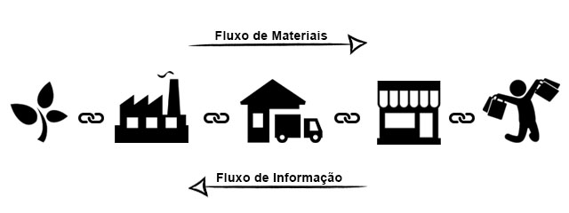
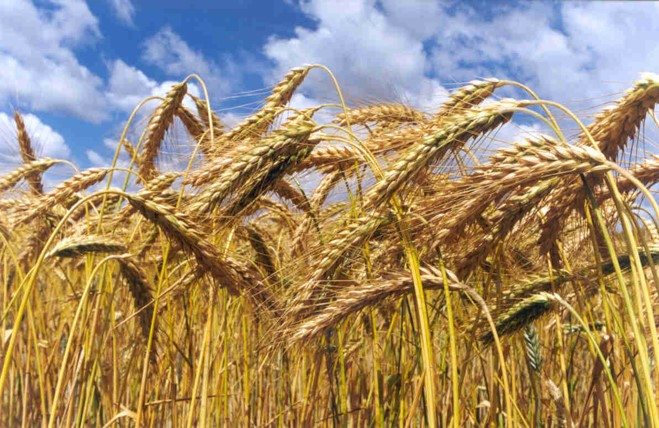

```{r child = "setup.Rmd"}
```

```{r xaringan-tile-view, echo=FALSE}
xaringanExtra::use_tile_view()
```

```{r xaringan-editable, echo=FALSE}
xaringanExtra::use_editable(expires = 1)
```

```{r xaringan-panelset, echo=FALSE, message=FALSE, warning=FALSE}
xaringanExtra::use_panelset()
xaringanExtra::style_panelset_tabs(panel_tab_font_family = "sans-serif")
```

```{r xaringanExtra-clipboard, echo=FALSE}
htmltools::tagList(
  xaringanExtra::use_clipboard(
    button_text = "<i class=\"fa fa-clipboard\"></i>",
    success_text = "<i class=\"fa fa-check\" style=\"color: #90BE6D\"></i>",
    error_text = "<i class=\"fa fa-times-circle\" style=\"color: #F94144\"></i>"
  ),
  rmarkdown::html_dependency_font_awesome()
)
```

```{r xaringan-fit-screen, echo=FALSE}
xaringanExtra::use_fit_screen()
```

```{r xaringan-extra-styles, echo=FALSE}
xaringanExtra::use_extra_styles(
  hover_code_line = TRUE,         #<<
  mute_unhighlighted_code = TRUE  #<<
)
```

```{r xaringan-scribble, echo=FALSE}
xaringanExtra::use_scribble()
```


class: inverse

.large[
[Logística é parte da minha vida?](https://valorinveste.globo.com/mercados/brasil-e-politica/noticia/2021/10/17/caminhoneiros-prometem-greve-a-partir-de-1o-de-novembro-se-governo-nao-atender-pedidos.ghtml)
]

"Segundo o líder caminhoneiro, mesmo que não haja greve, muitos caminhoneiros devem parar de rodar devido à alta do diesel. "A paralisação vai ser automática, a categoria vai parar porque não tem mais condições de rodar", afirma. "   
"André Braz, coordenador de Índices de Preços na FGV (Fundação Getúlio Vargas), estima que os reajustes anunciados nesta quinta-feira pela Petrobras devem acrescentar 1,52 ponto percentual à inflação brasileira nos próximos 30 dias."   
"Enquanto os economistas debatem os rumos do IPCA e da Selic, os brasileiros não sabem como vão chegar até o fim do mês." 
[Fonte](https://www.bbc.com/portuguese/brasil-60698045)

---

class: middle, center, inverse


## Quem sou eu???

```{r, echo=FALSE, message=FALSE, warning=FALSE, out.width="30%"}
knitr::include_graphics("img/reta.jpg")
```


---

class: middle, center, inverse

## Mundo do trabalho
## 4a revolução industrial
## Pandemia Sars-CoV-2
## Guerra 

---

## Proposta pedagógica

A intenção aqui é fazer com que o aprendizado seja mais dinâmico e ocorra de forma simultânea, fazendo com que o aluno tenha as bases teóricas e teste-as ao mesmo tempo.

A proposta pedagógica para desenvolvimento deste curso fundamenta-se no conceito de `Aprendizagem Baseada em Projetos`. São propostas atividades para desenvolvimento de competências (`Atividades de Aprendizagem`) e um `Projeto Integrador`, para consolidação e perspectiva integrada da disciplina. 

---

## Ementa da disciplina

- Visão Geral da Logística.   
- A Cadeia de Suprimentos (Supply Chain) - conceitos principais.   
- Organização de Suprimentos: funções e objetivos.   
- Compras e fornecedores.   
- Armazenagem.   
- Gestão de Estoques.   
- Just-in-Time.   
- Avaliação do sistema suprimentos.  

---

## Objetivos de aprendizagem

Por meio desta disciplina, os estudantes desenvolverão competências para:

1.  discutir, por meio de conhecimento teórico e prático, os elementos constitutivos das cadeias de suprimentos e suas interrelações.
2.  Elaborar propostas estratégicas para gestão da cadeia de suprimentos.
3.  Quantificar e comparar resultados esperados de determinadas soluções logísticas.
4.  Integrar análise de dados à gestão da cadeia de suprimentos com foco no processo decisório.


---


## Proposta de avaliação da aprendizagem

Pontos|	Atividade
------|----------
10| Estudos Autônomos 1 - Nivel de serviço logístico
10| Estudos Autônomos 2 - TICs e KPIs
10| Estudos Autônomos 3 – Logística Urbana
10| Estudos Autônomos 4 - Gestão de Transportes
10| Estudos Autônomos 5 - Gestão de estoques e armazenagem
10| Estudos Autônomos 6 - Redes Logísticas e Custos
10| Estudos Autônomos 7 - Multivarejo e Omnichannel
30| Projeto incremental 1

> As datas de entrega e o planejamento dos encontros está disponível no site da disciplina em http://places.education


---
## Recursos necessários

Será necessário o uso de planilha eletrônica (o aplicativo pode ser de escolha do aluno) e ao longo da disciplina serão indicados aplicativos FOSS para outras análises.

Turma Virtual do SIGAA para postagens de conteúdos e outras comunicações.

Site da disciplina: http://places.education

---

## Comunicação

Toda comunicação individual com a docente deverá acontecer por meio do email institucional do docente, deve conter no campo "assunto" o texto `<Log-ADM>`ou `<Log-EPC>` e deve ser assinada com seu nome completo. Por favor, utilize o email institucional para comunicação com o docente: renataoliveira@cefetmg.br

---

## Políticas institucionais e da disciplina

.panelset[

.panel[.panel-name[Como agir?]

Os estudantes e professores têm a responsabilidade de manter um ambiente de aprendizagem adequado e motivante. 

A cortesia profissional e a sensibilidade são especialmente importantes no que diz respeito a indivíduos e discussões que lidam com diferenças de raça, cor, cultura, religião, credo, política, status de veterano, orientação sexual, gênero, identidade e expressão de gênero, idade, deficiência e nacionalidades. As listas de classes são fornecidas ao instrutor com o nome legal do aluno. Terei prazer em honrar seu pedido de dirigir-se a você por um nome alternativo ou pronome de gênero. Não serão tolerados atos de discriminação ou assédio contra ou por qualquer funcionário ou estudante.
]

.panel[.panel-name[Como trabalhar?]

Honestidade acadêmica é um princípio fundamental desta disciplina. Desonestidade acadêmica configura-se por: cópias literais de textos ou ideias sem citação de fonte, fabricações e falsificações de qualquer natureza, plágio, mentira, suborno, comportamento ameaçador ou cumplicidade com desonestidade acadêmica em qualquer nível. 

Os estudantes que forem considerados em violação da política de integridade acadêmica estarão sujeitos tanto a sanções acadêmicas do membro docente quanto a sanções não acadêmicas. Se você tiver alguma dúvida sobre citações adequadas, configuração de plágio, etc., por favor, não hesite em perguntar!
]
]


---

## Organização das atividades:

**Composição dos grupos de trabalho:** A turma deverá ser dividida em **grupos**. Esses grupos devem se manter para realização de todos os projetos e atividades da disciplina. A professora indicara a plataforma que permitirá o desenvolvimento das atividades/projeto de maneira colaborativa, com registro das discussões.  


---

## O que é Logística?

Penso que o logística é muito mais um conjunto de princípios do que uma operação. "Fazer" `logística` relaciona-se à **promover o acesso a bens de consumo  e serviços, essenciais à vida humana e promovidos pelo consumo, destinados ao consumidor final da maneira mais eficiente e responsiva possível**. 

.question[
“**Logística** é dispor a **mercadoria ou o serviço** certo, no **lugar** certo, no **tempo** certo e nas **condições desejadas**, ao mesmo tempo em que fornece a **maior contribuição à empresa**”. 
(Ballou, 2001)
]
---

# O que é uma cadeia de suprimentos?
.question[
A cadeia de suprimentos é a integração dos processos industriais e comerciais, partindo dos fornecedores iniciais até o consumidor final, gerando produtos, serviços e informações que agreguem valor para o cliente, maximizando a lucratividade total.
]
```{r echo=FALSE, message=FALSE, warning=FALSE}

```
---

# Como esses conceitos passaram a fazer parte das nossas vidas?

.pull-left[
```{r echo=FALSE, message=FALSE, warning=FALSE}

```
```{r echo=FALSE, message=FALSE, warning=FALSE}

```
]

.pull-right[
```{r echo=FALSE, message=FALSE, warning=FALSE}

```
]

---
# Evolução da logística 

```{r echo=FALSE, message=FALSE, warning=FALSE}
knitr::include_graphics("./img/log5.png")
```


---
class: inverse, middle

.center[
# Obrigada!
]

<a href="mailto:renataoliveira@cefetmg.br"><i class="fa fa-paper-plane fa-fw"></i>&nbsp; renataoliveira@cefetmg.br</a><br>
<a href="http://twitter.com/retaoliveira"><i class="fa fa-twitter fa-fw"></i>&nbsp; @retaoliveira</a><br>
<a href="http://github.com/retaoliveira"><i class="fa fa-github fa-fw"></i>&nbsp; @retaoliveira</a><br>
